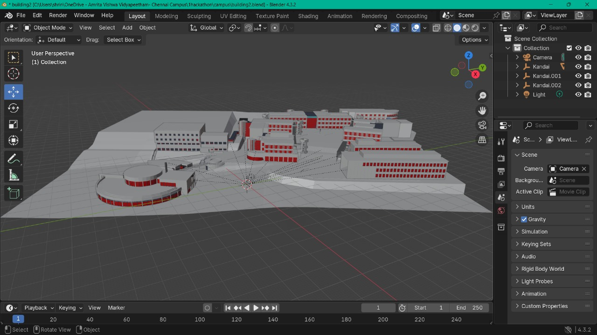
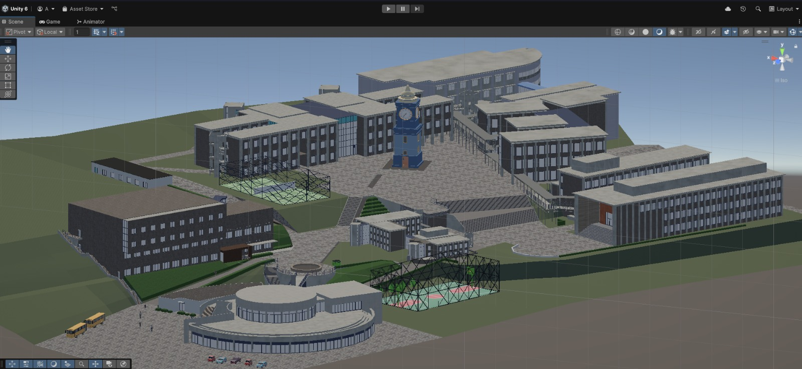
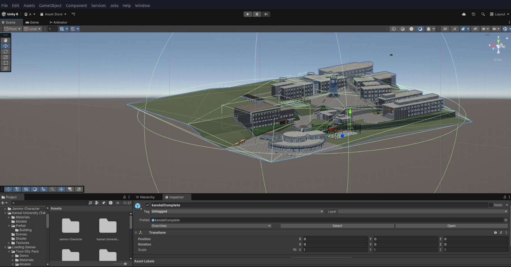

# Campverse

Welcome to the **Campverse**! Virtual Connect Project This immersive, cross-platform virtual environment aims to revolutionize the way people collaborate, relax, and socialize. Designed with inclusivity and engagement in mind, Virtual Connect offers dynamic spaces for corporate collaboration, personal connections, and even health and education.

## Problem Statement

Boredom and lack of engaging, enjoyable experiences hinder effective team collaboration and personal connections, leaving people seeking more fun, dynamic ways to interact and bond in virtual spaces.

Breaks are crucial for productivity. Virtual Connect provides a platform to make breaks sociable and enjoyable, incorporating fun games and interactive activities. This reduces the need to leave the workspace for relaxation, saving time and fostering a sense of connection. It also bridges distances, enabling meaningful interactions with family and friends in virtual spaces, offering the feeling of being at home. Meetings and events can be transformed into enjoyable experiences.

## Features

### Corporate Collaboration Spaces
- **Team-Building Activities**: Engage in virtual team-building exercises like escape rooms or scavenger hunts tailored to company culture.
- **Training Simulations**: Interactive learning environments for onboarding and skill development.
- **Conference Rooms**: Meet in virtual offices for brainstorming sessions, whiteboarding, or casual coffee breaks.

### Personalized Social Gatherings
- **Family Reunions**: Virtually gather with family in a 3D model of your home for birthdays, holidays, and other milestones.
- **Friend Hangouts**: Relive favorite moments with friends in virtual recreations of college days or popular hangout spots.

### Event Hosting
- **Weddings and Celebrations**: Host virtual ceremonies that mirror real venues, allowing guests worldwide to participate.
- **Hackathons and Competitions**: Organize cost-effective, engaging virtual events for schools, colleges, or corporations.

### Health and Wellbeing
- **Virtual Therapy Spaces**: Provide calming environments like tranquil gardens or serene lakesides for mental health sessions.
- **Fitness Challenges**: Organize virtual marathons or yoga sessions in picturesque virtual locations.

### Real Estate and Architecture
- **Home Previews**: Provide virtual tours of properties to prospective buyers.
- **Design Feedback**: Allow clients to walk through a virtual building and suggest changes before construction begins.

### Tourism and Museums
- **Virtual Tours**: Recreate historical sites or destinations for immersive exploration.
- **Cultural Exchange**: Experience different cultures through festivals, local markets, or famous landmarks.

### Special Education Needs
- **Skill Training**: Help differently-abled individuals practice real-world skills in safe, controlled virtual environments.
- **Therapeutic Interaction**: Create spaces for kids with autism or social anxiety to practice interactions or attend virtual classrooms at their own pace.

## Installation

### Prerequisites
- Unity (version 2024 or higher)
- A platform for testing (VR headset, mobile, or desktop)

### Steps to Install
1. Clone this repository:
    ```bash
    git clone https://github.com/RealAditya/virtual-connect.git
    ```

2. Open the project in Unity:
    - Launch Unity Hub and click on `Add` to add the project folder.
    - Open the project.

3. Build the project for your desired platform:
    - For VR: Set up your Unity environment for VR development.
    - For Mobile: Configure for Android/iOS.
    - For Desktop: Build for Windows/Mac.

4. Test the project on your desired platform.

## Usage

To start your virtual experience:
1. Launch the scene `MainScene` in Unity.
2. Choose the mode: Corporate, Social, Event Hosting, or Wellness.
3. Join the multiplayer session for collaborative or social experiences.
4. Explore virtual environments and enjoy the activities.

## Screenshots

  
*View of the 3D-World in Blender*

  
*After Adding Textures in Unity*

  
*Adding further animations,logic and physics*

## Development

To contribute to the project, please fork the repository and create a pull request with your changes. Ensure you follow the code style guidelines and pass all tests before submission.

### Code Structure
- `Assets/`: Contains all game assets like textures, models, and scripts.
- `Scripts/`: Contains C# scripts for user interaction, multiplayer functionality, and environment management.
- `Scenes/`: Contains Unity scenes for various use cases.
- `Networking/`: Handles multiplayer connection and synchronization.

## License

This project is licensed under the MIT License - see the [LICENSE](LICENSE) file for details.

## Acknowledgements

- Unity for the powerful game development engine.
- [Placeholder for any other third-party libraries or tools used in the project].


